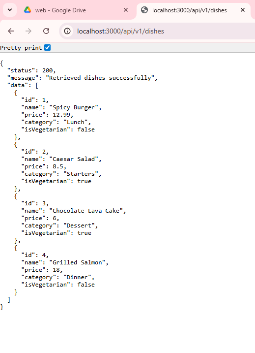

# RESTful API Activity - James Martin R. Dumas
## Best Practices Implementation 

**1. Environment Variables:**
- Why did we put `BASE_URI` in `.env` instead of hardcoding it?
- Answer: Storing `BASE_URI` in `.env` keeps environment-specific settings out of the codebase. This lets developers use different API endpoints for local testing, staging, and production without changing any code, and prevents sensitive configuration from being accidentally committed to version control.

- **2. Resource Modeling:**
- Why do we use plural nouns for routes?
- Answer: Plural nouns indicate that routes work with collections of resources, following REST conventions. For example, `/dishes` represents multiple dishes, making the API intuitive and consistent.

**3. Status Codes:**
- When do we use `201 Created` vs `200 OK`?
- Answer: Use `201 Created` when a POST request successfully creates a new resource, often including the new resource in the response body and a `Location` header with its URI. Use `200 OK` for successful GET, PUT, or PATCH requests that retrieve or update existing resources without creating new ones.

- Why is it important to return `404` instead of just an empty array or a generic error?
- Answer: `404 Not Found` clearly indicates the specific resource doesn't exist, while an empty array with `200 OK` means the request succeeded but the collection is empty. This distinction helps clients handle errors appropriately—they can show a "not found" page, validate user input, or retry with correct parameters. It also makes debugging easier by immediately identifying whether the issue is a wrong endpoint, invalid ID, or deleted resource.

**4. Testing:**
